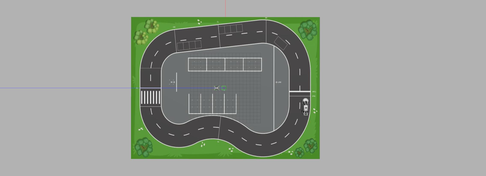
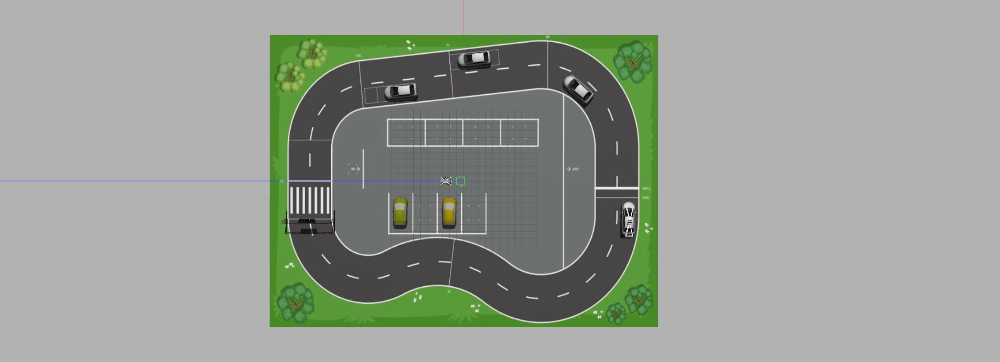
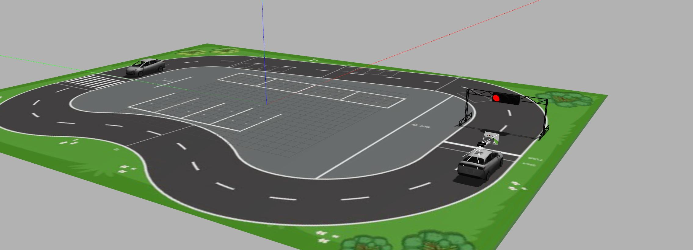
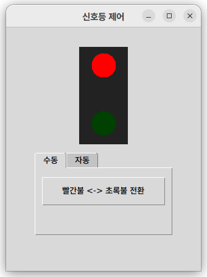
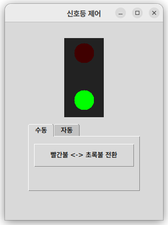
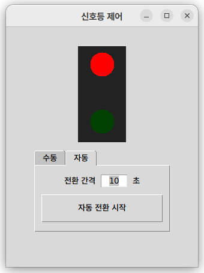

# H-모빌리티 클래스 자율주행 심화과정 시뮬레이션

성균관대학교 자동화연구실의 H-모빌리티 클래스 자율주행 심화과정 시뮬레이션 코드입니다.

## 1. 초기 환경설정
```
git clone https://github.com/SKKUAutoLab/H-Mobility-Autonomous-Advanced-Course-Simulation
cd ~/H-Mobility-Autonomous-Advanced-Course-Simulation
sh install.sh
source ~/.bashrc
```


## 2. 의존성 설치 (rosdep)
```
cd ~/H-Mobility-Autonomous-Advanced-Course-Simulation
export AMENT_PREFIX_PATH=''
export CMAKE_PREFIX_PATH=''
source /opt/ros/humble/setup.bash
rosdep install -i --from-path src --rosdistro humble -y
```


## 3. 패키지 빌드
```
cd ~/H-Mobility-Autonomous-Advanced-Course-Simulation
source /opt/ros/humble/setup.bash
colcon build --packages-select interfaces_pkg --allow-overriding interfaces_pkg 
source install/local_setup.bash

colcon build --symlink-install --packages-select camera_perception_pkg --allow-overriding camera_perception_pkg 
source install/local_setup.bash

colcon build --symlink-install --packages-select decision_making_pkg --allow-overriding decision_making_pkg 
source install/local_setup.bash

colcon build --symlink-install --packages-select debug_pkg --allow-overriding debug_pkg 
source install/local_setup.bash

colcon build --symlink-install --packages-select simulation_pkg --allow-overriding simulation_pkg
source install/local_setup.bash

colcon build --symlink-install --packages-select lidar_perception_pkg --allow-overriding lidar_perception_pkg
source install/local_setup.bash

colcon build --packages-select plugin_pkg
source install/local_setup.bash
```


## 4. 시뮬레이터 실행

### A. 장애물 없는 환경(시뮬레이션 과제 수행)
```
cd ~/H-Mobility-Autonomous-Advanced-Course-Simulation
sudo killall -9 gazebo gzserver gzclient; ros2 launch simulation_pkg driving_sim.launch.py
```



### B. 장애물 및 신호등 있는 환경
```
cd ~/H-Mobility-Autonomous-Advanced-Course-Simulation
sudo killall -9 gazebo gzserver gzclient; ros2 launch simulation_pkg mission_sim.launch.py
```
- 장애물 차량과 수직주차 차량 위치가 매 실행마다 무작위로 배치
- 장애물 감지를 위해 차량 전방에 라이다 추가



### C. H-모빌리티 환경 (신호등 앞 출발)
```
cd ~/H-Mobility-Autonomous-Advanced-Course-Simulation
sudo killall -9 gazebo gzserver gzclient; ros2 launch simulation_pkg hmobility_sim.launch.py
```
- 최종평가와 가장 유사한 환경 (신호등과 장애물 차량)
- 장애물 감지를 위해 차량 전방에 라이다 추가



---

## 5. 신호등 제어 GUI
`mission_sim` / `hmobility_sim` 실행 시 **신호등 제어 GUI** 가 함께 뜨며, 이 창으로 신호등 색을 바꾼다.
GUI 상단에는 현재 신호 상태가 표시되고, 하단 탭에서 **수동 / 자동** 모드를 선택한다.

- **수동** — `빨간불 <-> 초록불 전환` 버튼을 누를 때마다 색이 바뀐다.
- **자동** — `전환 간격(초)` 을 정하고 `자동 전환 시작` 을 누르면, 그 간격마다 빨강↔초록 이 자동으로 반복된다.

| 수동 (빨간불) | 수동 (초록불) | 자동 전환 |
|:---:|:---:|:---:|
|  |  |  |

<sub>본 저장소의 소스 코드는 <a href="LICENSE">GPL-3.0 License</a> 하에 공개됩니다. 교육·연구 목적으로 자유롭게 활용하실 수 있으며, 코드를 사용하거나 재배포하실 경우 성균관대학교 자동화연구실의 <i>H-모빌리티 클래스 자율주행 심화과정</i>을 출처로 밝혀 주시기 바랍니다.</sub>